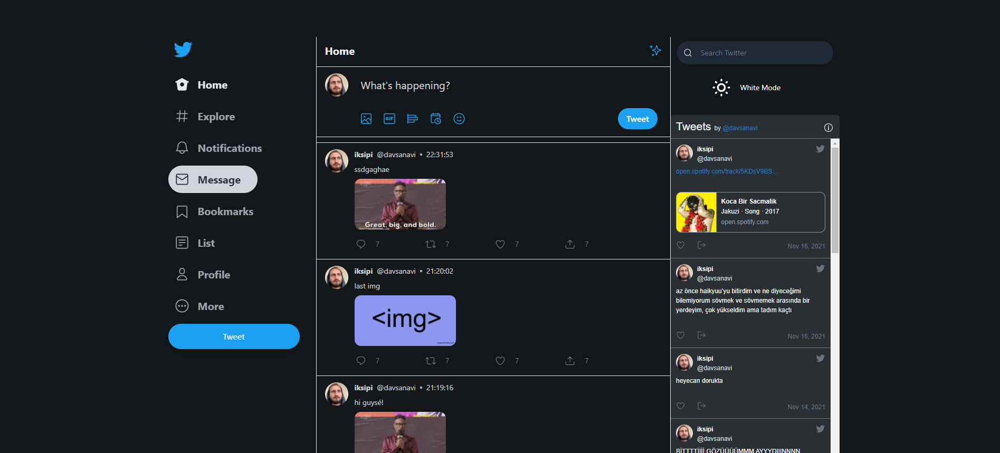
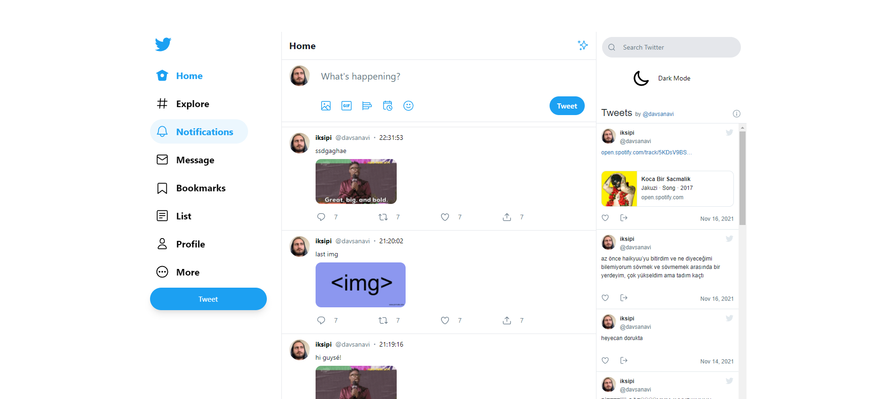

 

  

  <h3 align="center">Twitter Clone</h3>

  

    with React
     
     
  

# Tech

<a href ="https://tailwindcss.com/"> Tailwindcss</a> 
<a href ="https://reactjs.org/"> ReactJS</a> 
 <a href ="https://firebase.google.com/"> Firebase Firestore Database</a> 
 <a href ="https://create-react-app.dev/"> create-react-app</a> 
 <a href ="https://www.npmjs.com/package/react-twitter-widgets"> react-twitter-widgets</a> 

# Appearance

## Dark Mode

## White Mode

